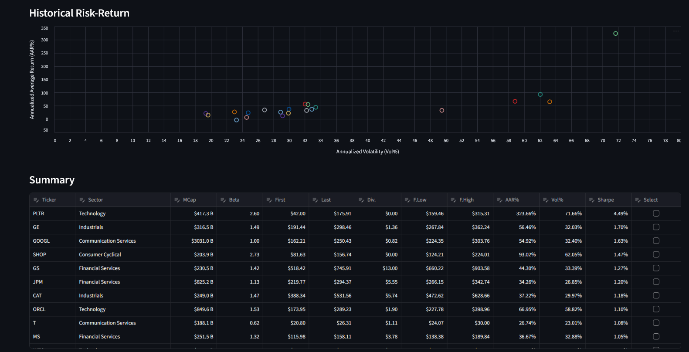

# 🚀 TradeSentinel Demo 2
Streamlit app showcasing trading simulations and analytics.

This demo showcases predictive insights and interactive visualizations for traders and analysts.

Click link for running the **live Streamlit demo:**

> **Tip:** On GitHub, links always open in the same tab. Right‑click and choose “Open link in new tab” if you prefer.)
---

## 💡 Key Features

- **📊 Unified Summary Table**  
  Aggregate financial data from multiple sources into a single, easy-to-read table.  

- **📈 Valuation Metrics & Simulations**  
  Calculate core valuation metrics and perform Monte Carlo simulations to forecast price ranges and risks.  

- **💰 Dividend Tracking**  
  Compute accumulated dividends over the selected period for a complete performance view.  

- **⏱ Dynamic Lookback Period**  
  All data, metrics, and forecasts automatically **recalculate** when the study period (lookback) is modified.  

- **🔍 Interactive Visualizations**  
  Explore historical and simulated data through charts and dashboards for better decision-making.  

---

## 📝 Notes

- This repository is a **showcase/demo version only**; the full source code is private.  
- For reference, the **legacy version (Demo 1)** is available [here](https://github.com/sebakremis/TradeSentinel-Demo1).  

---

## 📌 Screenshots

  
*Example of TradeSentinel Dashboard in action.*

---

## 📬 Contact

For inquiries or collaborations, feel free to reach out: **[skremis@ucm.es]**
